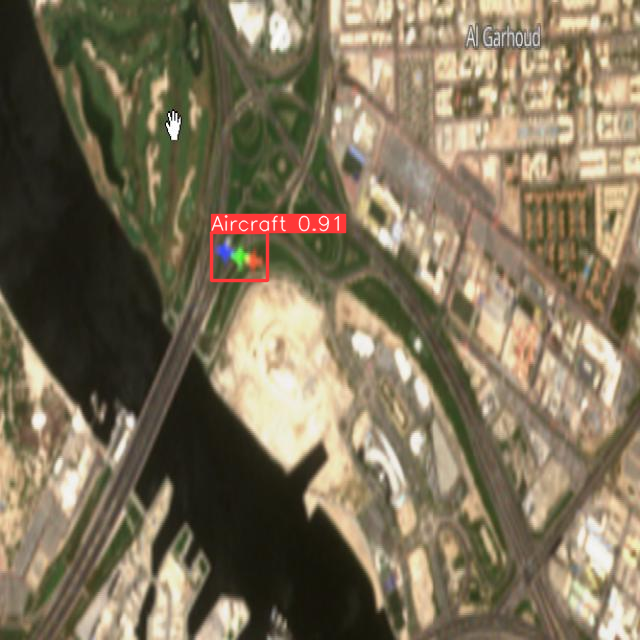
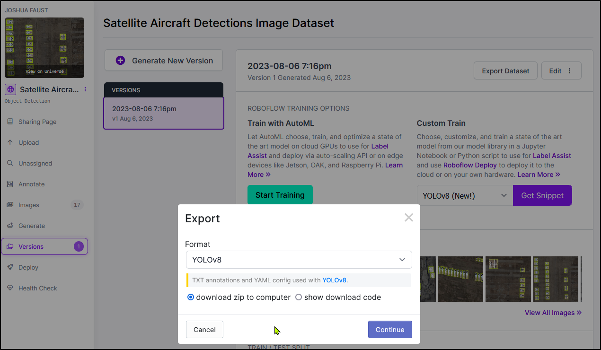

# dev-aircraft-ident
Practice to build/play with a model to detect aircraft in satellite imagery

- **Dataset (building in progress)** - https://app.roboflow.com/ufo-optix/ufo-bounding-box-detection


## About

This uses the [YOLOv8 model](https://github.com/ultralytics/ultralytics) due to the following reasons:

1. It's extremely fast.
2. It's very flexible (Formats that PyTorch, Tensorflow, etc. can consume).
3. It's stupid easy to add new weights and classes to existing models and/or create a new model. 

## Models

All models are located in the `models` directory.

- August 8th, 2023 Training:
  - 

## Dataset Building

In the repository, I am aggregating [EO Browser](https://apps.sentinel-hub.com/eo-browser/) (Located in the `raw_images` directory)images that contain known aircraft movement defined by an RGB signature on the image. These images are then uploaded to our [UFO Bounding Box Detection Dataset](https://app.roboflow.com/ufo-optix/ufo-bounding-box-detection) where we will then annotate the images and prepare them to be trained against. We will need ~2,000 images for a single class according to [darknet](https://github.com/AlexeyAB/darknet).

> for each object which you want to detect - there must be at least 1 similar object in the Training dataset with about the same: shape, side of object, relative size, angle of rotation, tilt, illumination. So desirable that your training dataset include images with objects at different: scales, rotations, lightings, from different sides, on different backgrounds - you should preferably have 2000 different images for each class or more, and you should train 2000*classes iterations or more

**Image Naming** - Each image is named by the [ICAO code](https://en.wikipedia.org/wiki/ICAO_airport_code) for the airport/base.

To get access to the training dataset with the ability to add and annotate images, please send us your email in Discord.


## Training

Here have been my steps that you can use to reproduce training.

1. Find images of content that has the object you're looking for. You're going to need a-lot of them (100-500 images).
2. Head over to https://app.roboflow.com/ufo-optix/ and create a new project and add your images or add images to an existing project such as the https://app.roboflow.com/ufo-optix/ufo-bounding-box-detection.
3. Annotate your images and save the annotations.
4. Export your Generated Dataset into YOLOv8 format as a ZIP file.
   1. 
5. Unzip and move:
   1.  `train` folder to `<path_to_git_repo>/data/train`
   2.  `test` folder to `<path_to_git_repo>/data/test`
6.  Make sure the `config.yaml` has your systems information and any classes (the items you annotated).
    1.  ```yaml 
        path: <PATH_TO_GIT_REPO>\dev-aircraft-ident
        train: data\images\train
        val: data\images\train

        nc: 1

        names: ['Aircraft']
        ```
7. Open the aircraft_detection notebook and run it. 
8. Once you've trained your model, you will see a `runs` directory with the training information and your test cases as images that have been analyzed. This folder will also have your new weights. 

## Example Datasets

1. For Satellite Aircraft Training, I built my own and used the following:
   1. https://universe.roboflow.com/gdit/aerial-airport
   2. https://app.roboflow.com/joshua-faust-6mncn/satellite-aircraft-detections